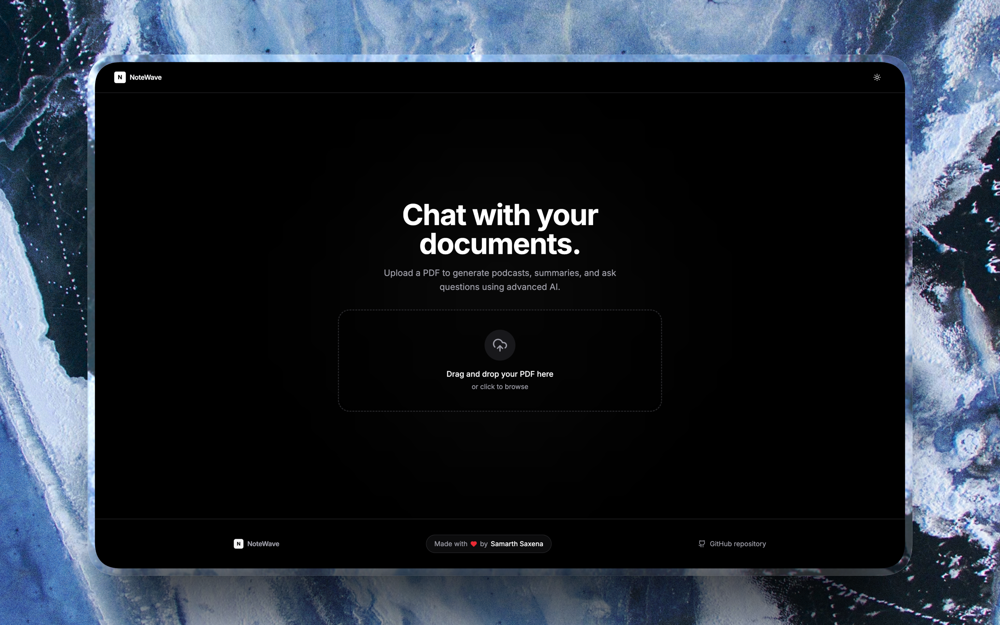

<div align="center">

# NoteWave

## **Your AI Research Copilot — Powered by RAG & Voice**

[Try Demo Now!](https://notewave.samarthsaxena.dev/)

</div>

**NoteWave** is an AI-powered "Second Brain" and immersive research ecosystem. It transforms static PDF documents into dynamic knowledge graphs, interactive research studios, and voice-enabled learning environments.

Built with **Next.js 16 (Turbopack)**, NoteWave utilizes high-integrity LLM orchestration, vector search, and real-time audio processing to redefine how we interact with documents.

<div align="center">
  
</div>

## ⚠️ Important Notice

> **It is strongly recommended to run this application locally.**  
> The publicly deployed version is intended purely as a portfolio demo. Because it relies on free-tier API keys (Groq & ElevenLabs), it may be **rate-limited**, become unavailable, or run out of credits without notice. Running locally gives you full control and complete data privacy.

---

## The Intelligence Studios (v4.0)

NoteWave is organized into specialized "Studios," each designed for a specific cognitive task:

- **RAG-Powered Chat**  
  Professional document analysis with semantic source citing using **Pinecone** and **Groq (Llama 3.3 70B)**.

- **Podcast Studio**  
  Generates an engaging audio deep-dive conversation between AI hosts. Supports MP3 downloads and real-time script tracking.

- **Flashcard Studio**  
  AI-driven concept extraction with a 3D flip UI and "Creator Mode" for manual additions.

- **Knowledge Graph**  
  A **3D Force-Directed Graph** that visualizes relationships between concepts in your research.

- **Agentic Debate**  
  Multi-persona research environment where *Dr. Skeptic*, *The Weaver*, and *Veritas* debate the core thesis of your documents.

- **Verified Vault**  
  Integrity auditor that scans for bias, logical fallacies, and "hallucination" scores.

- **Quiz Studio**  
  Adaptive learning module that generates custom assessments and detailed mastery reports.

- **Voice Immersion**  
  Hands-free mode using **Deepgram Nova-2** (speech-to-text) and **OpenAI TTS-1** (neural voice replies).

---

## Immersive Features

- **Adaptive Settings Studio**  
  Bio-Adaptive Profile that tracks cognitive load and suggests personalized learning styles (Kinesthetic, Visual, etc.).

- **Focus Mode**  
  UI transformation that dims distractions and simplifies the workspace for deep work.

- **Command Orchestration**  
  Global `/` command palette with full keyboard navigation for instant studio switching.

- **Local Persistence**  
  Session settings and document metadata synced to `localStorage` for privacy-first continuity.

---

## Interface Preview

### 1. Dashboard (3-Column Active State)
Centered chat interface with resizable sidebars for sources and studios.


### 2. Studio Hub (Zero State)
Clean directory guiding users to specialized AI tools.


---

## Tech Stack

- **Core:** [Next.js 16](https://nextjs.org/), TypeScript, Tailwind CSS, Shadcn/UI
- **Intelligence:** Llama 3.3 70B via **Groq**
- **Vector Engine:** **Pinecone** (Serverless)
- **Embeddings:** Hugging Face (`all-MiniLM-L6-v2`)
- **Voice STT:** **Deepgram** Nova-2 (sub-300ms latency)
- **Voice TTS:** ElevenLabs
- **Spatial UI:** `react-force-graph-3d` & Three.js

## System Architecture

1. **Ingestion Pipeline**  
   PDF text is semantically chunked, embedded, and stored in Pinecone with strict filename filtering.

2. **Hardened Chat Logic**  
   High-integrity system prompt prevents hallucinations and enforces academic rigor.

3. **Flashcard Generation**  
   AI extracts key concepts and definitions to create interactive study decks.

4. **Command Orchestration**  
   Custom `/` palette with Up/Down/Enter navigation for seamless studio switching.

## Challenges & Learnings

- **Streaming Synchronization**  
  Eliminated "text stuttering" using accumulator pattern + `TextDecoder` stream handling.

- **Layout Fluidity**  
  Built resizable sidebar system that preserves perfect header alignment across columns.

- **Conversational Awareness**  
  Fine-tuned prompt to gracefully handle greetings while enforcing document-only focus.

---

## How to Run Locally

1. **Clone & Install**

   ```bash
   git clone https://github.com/samarthsaxena2004/note-wave.git
   cd note-wave
   npm install
   ```

2.  **Environment Variables (`.env.local`):**
    ```env
    GROQ_API_KEY=your_key
    PINECONE_API_KEY=your_key
    PINECONE_INDEX_NAME=note-wave
    HUGGINGFACE_API_KEY=your_key
    DEEPGRAM_API_KEY=your_key
    OPENAI_API_KEY=your_key
    ELEVENLABS_API_KEY=your_key
    ```

3.  **Install Radix Primitives (If missing):**
    ```bash
    npx shadcn-ui@latest add switch progress dialog badge
    ```

4.  **Run:**
    ```bash
    npm run dev
    ```
    Open [http://localhost:3000](http://localhost:3000) in your browser.

> **Troubleshooting:** If the application fails due to a retired model or deprecated API call, please refer to the comprehensive debugging steps in the [`MAINTENANCE_GUIDE.md`](MAINTENANCE_GUIDE.md) file in the repository root.
---

## Roadmap

- [x] **Phase 3 (Personalization):** Quiz Studio, Mastery Tracking, and Settings Studio.
- [x] **Phase 4 (Immersion):** Functional Voice-to-Concept (V2C) and Neural TTS.
- [ ] **Phase 5 (Synthesis):** Recursive multi-document summaries and Insight Export (PDF/Markdown).
- [ ] **Phase 6 (Sovereignty):** Cloud Sync via Supabase and user authentication.
- [ ] **Phase 7 (Neural Performance):** Edge deployment and local LLM fallback (Ollama).

---

## Contributing

Contributions are welcome! If you have ideas for features (e.g., persistent database storage, user authentication), feel free to fork the repo and submit a PR.

1.  Fork the Project
2.  Create your Feature Branch (`git checkout -b feature/AmazingFeature`)
3.  Commit your Changes (`git commit -m 'Add some AmazingFeature'`)
4.  Push to the Branch (`git push origin feature/AmazingFeature`)
5.  Open a Pull Request

---

## Acknowledgements

* **Project Blueprint:** Inspired by **Google NotebookLM**'s core research and application design.
* **Architectural Guidance:** Strategic design, debugging, and quality assurance provided by the **Gemini 2.5 Flash** AI assistant.

### Crafted with ❤️ by [Samarth Saxena](https://samarthsaxena.dev/)
